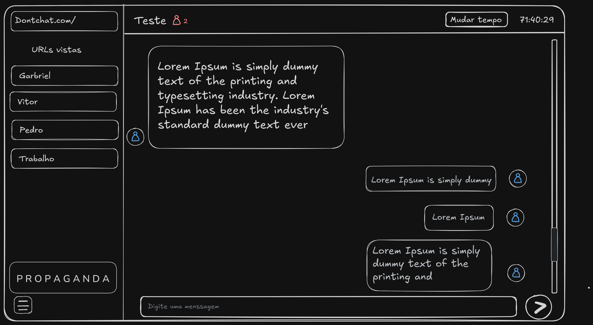

# DONTCHAT

O Dontchat é um site que permite criar chats salvos diretamente em URLs do navegador.  
A proposta é facilitar o compartilhamento rápido de conversas sem necessidade de cadastro.

O projeto foi inspirado no site [dontpad.com](https://dontpad.com)

## Ideia inicial do design

